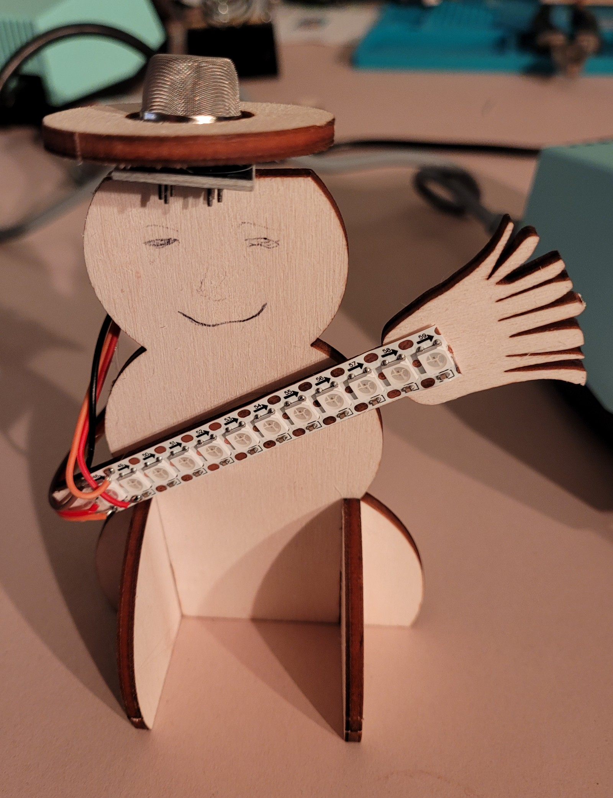
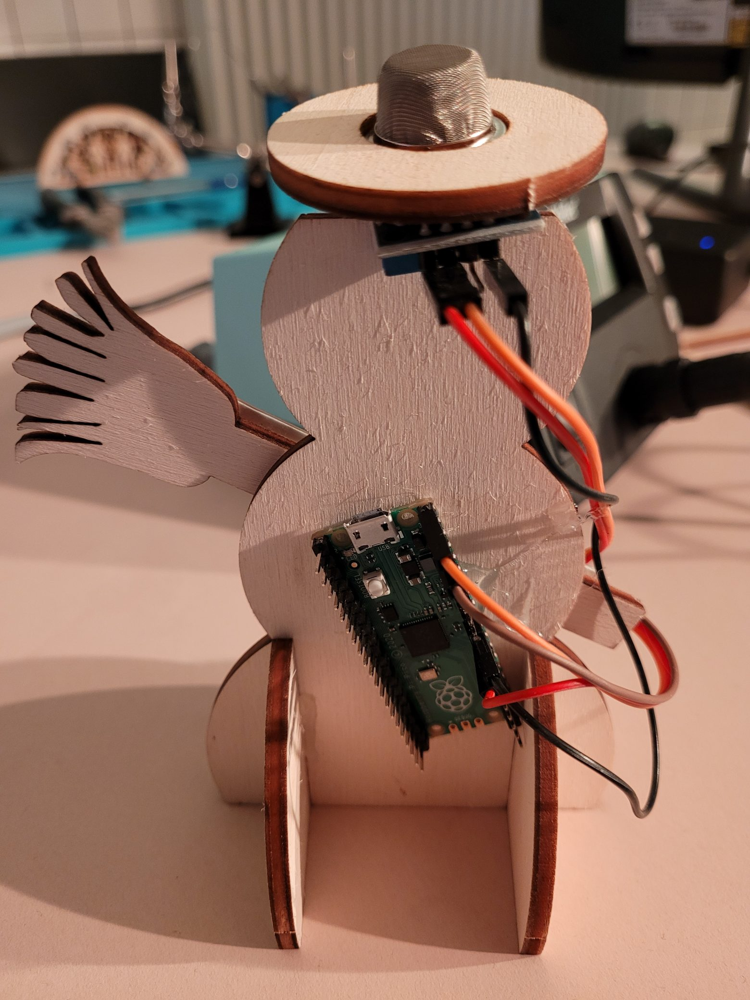
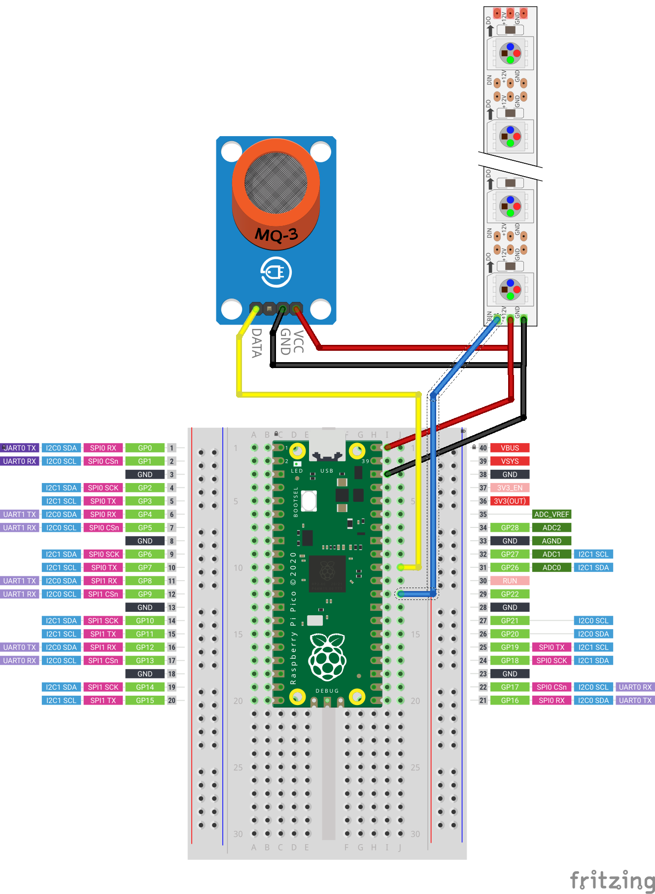

# Dokumentation zu Nichträuchermännchen

Projekt Schneemann.

## Worum geht's

Dieser Schneemann (Nichträuchermännchen) ist ein Luftqualitätsindikator.

Der Sensor im Hut ist ein CO, CO² und Alkoholsensor. Der Raspberry Pi Pico liest ihn aus und steuert 
die LEDs auf dem WS2812b-LED-Streifen abhängig von den Sensordaten.

## Schaltplan

Den Plan gibt es auch als  und als .

Dort sieht man, wie der Sensor und der LED-Streifen mit dem RasPi verbunden werden.

**VCC** vom Sensor und **+5V** vom LED-Streifen gehen auf den Pin **VBUS** des RasPi
**GND** vom Sensor und **GND** vom LED-Streifen gehen auf den Pin **GND** des RasPi
**A0** vom Sensor liefert die Daten auf **GP26** des RasPi, der dazu auf Analog-Ein programmiert wird.
**DIN** des LED-Streifens geht auf **GP22** des RasPi, der darüber die Farben der LEDs steuert.

